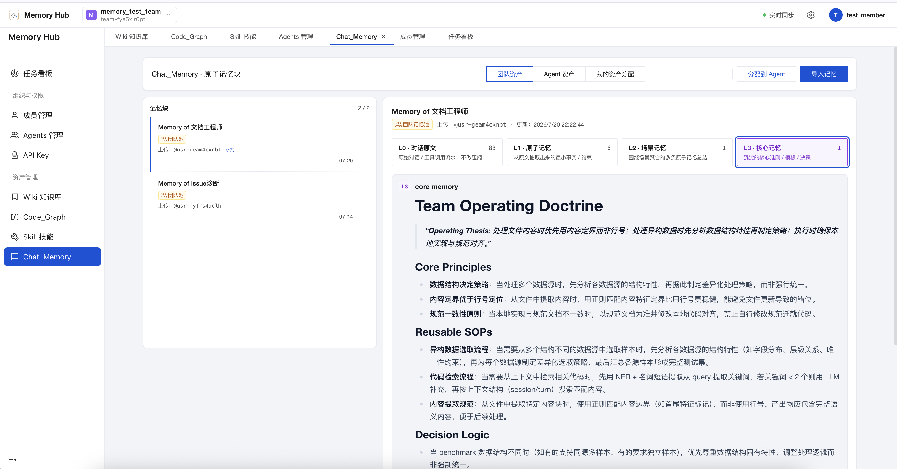
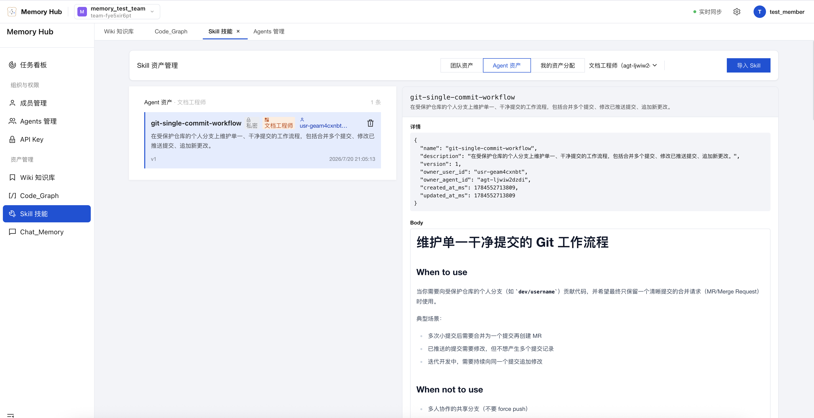
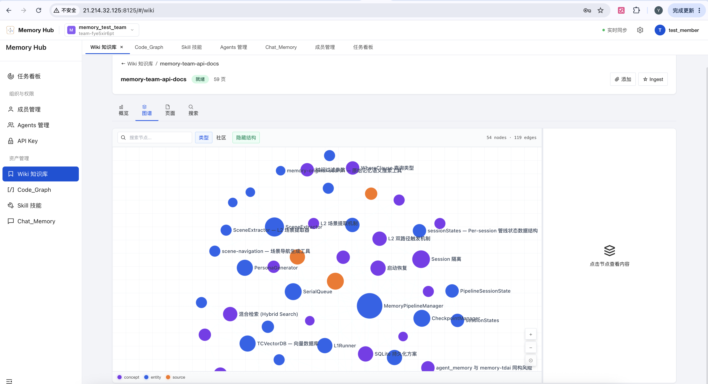
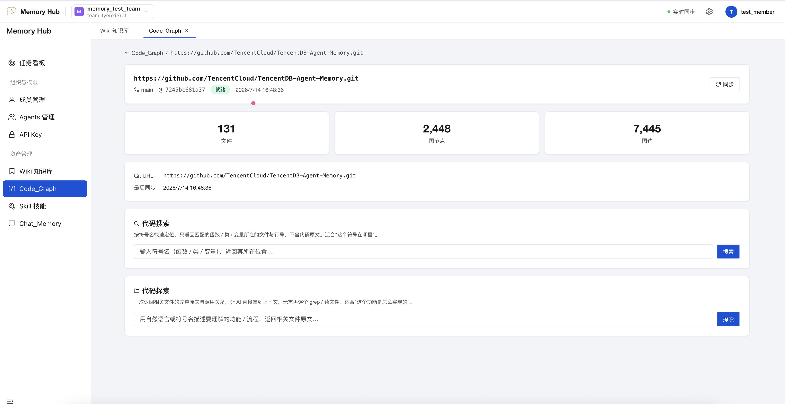
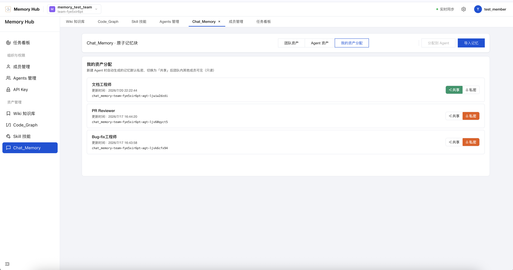
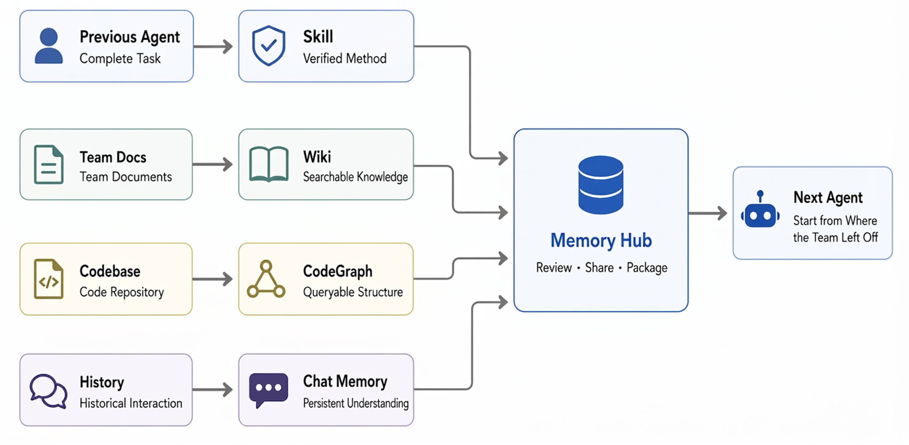
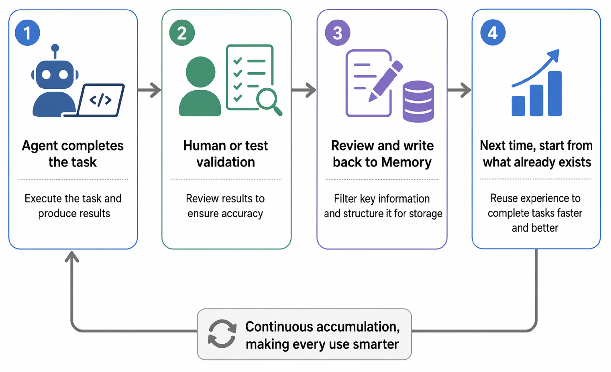
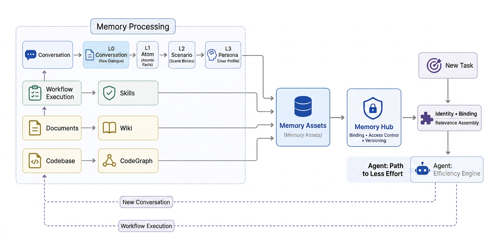

<div align="center">


### Agents remember. Humans innovate.

<a href="https://trendshift.io/repositories/29310?utm_source=repository-badge&amp;utm_medium=badge&amp;utm_campaign=badge-repository-29310" target="_blank" rel="noopener noreferrer"></a>

[](https://www.npmjs.com/package/@tencentdb-agent-memory/memory-tencentdb)
[](./LICENSE)
[](https://nodejs.org/)
[](https://github.com/openclaw/openclaw)
[](https://hermes-agent.nousresearch.com/docs/)
[](https://discord.gg/dJQM6mKMF)

[Installation](#installation) · [What is it?](#what-is-tencentdb-agent-memory) · [Team Play](#one-play-style-build-a-growing-agent-team-for-a-one-person-company) · [Technical Implementation](#technical-implementation) · [Benchmark](#benchmark)

[**English**](./README.md) · [简体中文](./README_CN.md)

</div>

---

> **Latest:** Team Memory Beta is evolving quickly — install it and start exploring in minutes.

<video src="assets/videos/memoryhub_demo.mov" width="100%" controls autoplay loop muted playsinline></video>


# Installation

Start all three services in one go (`memory-core` + `memory-hub` + `proxy`):

```bash
git clone https://github.com/Tencent/TencentDB-Agent-Memory.git
cd TencentDB-Agent-Memory/deploy/global-images
cp .env.example .env
$EDITOR .env       # Fill in two sets of LLM parameters (memory group + proxy group)
./start-all.sh     # Launch everything with one command; when finished, it prints a one-liner you can paste directly into Claude
```

Open the panel: [http://localhost:8125](http://localhost:8125).

Complete installation documentation (standalone Memory Hub deployment, Proxy + Claude Code usage, stop and cleanup, port reference, etc.) is available in [**INSTALL.md**](./INSTALL.md) (中文: [INSTALL_CN.md](./INSTALL_CN.md)).

### Migrating data from an older version

If you're already on an older release (v1.x / v0.x) and want to bring your existing data over to v2.0.0+, we provide a migration tool:

See [**Data Migration Tool (v2 → v3)**](./MemoryCore/scripts/migrate-v2-to-v3/README.md) for full usage and flags. New installations can skip this.

# What is TencentDB Agent Memory?

We started from a practical question: **How do you reduce repetitive work when using Agents?**

If project context has already been explained, it shouldn't need to be repeated in a new session. If documents have already been read, every Agent shouldn't have to start again from page one. A workflow that already works shouldn't have to be rediscovered next time.

Memory here means more than just "remembering conversations." **Any information that helps the next Agent avoid reinventing the wheel should be saved, organized, and reused.**

```text
Existing information → Reusable memory assets → Fewer turns → Less rework → More stable results and higher efficiency
```

### Let experience accumulate, flow, and pass on to the next Agent

**Memory Hub** for Agent teams closes the loop across the entire experience lifecycle: work produces assets, assets circulate through the team, and new members can load the team's save file on day one.

1. **Automatic asset extraction**: Extract Chat Memory and Skills from conversations and tasks; convert documents and code into Wiki and CodeGraph; then manage, review, and route them consistently.
2. **Portable & multi-Agent compatible**: Memory assets are decoupled from Agent frameworks — they can move across frameworks and be shared and maintained by multiple Agents and team members.
3. **Cold-start friendly**: Import existing documents, codebases, and Agent conversation sessions. New Agent teams can start from existing experience instead of learning from scratch.

### 🧠 A brain that remembers people and context

- **Chat Memory** retains preferences, facts, decisions, and interaction history.
- Each Agent automatically gets its own memory when created — no need to re-introduce yourself next time.
- L0 Conversation → L1 Atom → L2 Scenario → L3 Persona — raw conversations are distilled layer by layer.



> "Don't refactor the old auth module — mobile is still using it." — Context this costly shouldn't depend on humans repeating it every time.

### ⚡ A Skill library that accumulates expertise

- After completing complex work, Agents can extract and manage reusable Skills from conversations and tool calls, and import them into the context of a designated Agent when needed.
- A Skill isn't just a prompt snippet; it has versions, resource files, trigger boundaries, execution steps, and validation rules.
- Personal Skills are private by default; after review, they can be shared with the team and assigned to other Agents.



> Troubleshooting, code review, release checklists — learn it once, and the whole team can use it.

### 📖 A knowledge map that reads both docs and code

- **Wiki** turns product docs, design specs, and ops runbooks into structured pages with a link graph. (Inspired by Karpathy's LLM knowledge base.)



- **CodeGraph** indexes code symbols, files, call relationships, and impact paths.


- Agents can search, read, inspect callers/callees, and perform impact analysis before modifying code.

> Wiki keeps Agents from reading every file list before getting to work. CodeGraph doesn't just tell them "the code is here" — it tells them "changing this might affect those."

### 🛡️ A team memory panel controlled by humans

- Create teams and Agents in Memory Hub; review, share, and equip memory assets.
- Manage ownership, versions, status, visibility, usage counts, and Agent bindings in one place.
- `private` belongs strictly to the Owner; `team` is visible to all team members; `restricted` grants precise access via User / Role / Agent ACLs.




## Cold Start: Load the Save File, Then Get to Work

Most Agents' first task is re-learning your project. TencentDB Agent Memory turns the learning cost you've already paid into a save file:



Specifically, these existing assets can be imported directly and processed automatically in the panel:

- **Codebases**: Import existing repositories — **CodeGraph** automatically indexes symbols, files, call relationships, and impact paths.
- **Documents & files**: Import relevant docs and files — **Wiki** automatically generates structured pages with a link graph.
- **Conversation sessions**: Import past Agent conversation sessions — **Skills and Chat Memory** are automatically extracted as reusable assets.

> Stop retraining every Agent. Give it the save file.

## One Play Style: Build a Growing Agent Team for a One-Person Company

Open Memory Hub and create a team:

```text
Tiny but Serious Inc.
├── 👤 You · Set goals / Make decisions
├── 🔭 Scout · Research / Find opportunities
├── 🛠 Builder · Write code / Build products
├── 🧪 Reviewer · Test / Find issues
└── 🧠 Agent Memory · Preserve the team's experience
```

You're not opening four disconnected chat windows — you're assembling a squad with different roles that can inherit the team's accumulated experience.

### Recruit first, then equip

```text
🔭 Scout
   ├── User interview Chat Memory
   ├── Market research Wiki
   └── Competitive analysis Skill

🛠 Builder
   ├── Product Wiki
   ├── Project CodeGraph
   └── Feature Delivery Skill

🧪 Reviewer
   ├── Historical incident Chat Memory
   ├── Project CodeGraph
   └── Release Checklist Skill
```

Different roles, different loadouts. Less noise — give each Agent the memory assets it actually needs to get work done.

**The company can be tiny. Experience can compound forever.**

## Memory Assets, Not a Chat Log Warehouse

RAG answers "what can be found?" Team Memory also answers "who can use it, which version is valid, and which Agent should receive it."

| | Chat History | Standard RAG | TencentDB Agent Memory |
| :--- | :---: | :---: | :---: |
| Cross-session user understanding | △ | △ | ✅ Chat Memory |
| Distilled executable experience | — | — | ✅ Skill |
| Document structure & relationships | — | △ Chunk retrieval | ✅ Wiki + Link Graph |
| Code call graphs & impact scope | — | △ Text match | ✅ CodeGraph |
| Ownership / Version / Status | — | — | ✅ |
| Team sharing & Agent loadout | — | — | ✅ |
| Private / Team / ACL | — | △ | ✅ |

## Memory Hub Is Not a Display Board — It's a Control Panel

| Play Style | What you do in the Hub |
| :--- | :--- |
| **Team Up** | Create teams, add people and Agents, define sharing boundaries |
| **Asset Library** | Browse, search, review, and manage Chat Memory, Skills, Wiki, and CodeGraph |
| **Agent Loadout** | Bind different memory assets to different Agents; adjust priority and usage mode |
| **Knowledge Workshop** | Build Wiki and CodeGraph; monitor processing status and asset metadata |
| **Access Control** | Switch between private, team, and ACL-based access; revoke sharing when needed |

When you open an asset, what matters is not just "what it says," but also "where it came from, which version it is, who it's assigned to, and whether it's been used recently."

## Every Loop Gains Experience



Memory doesn't run the Agent loop; it ensures the next iteration inherits the previous one's results: valuable interactions stay in Chat Memory, proven workflows are distilled into Skills, and document/code changes are updated through Wiki ingest and CodeGraph sync.

**Without Memory, loops may just repeat faster. With inherited memory, each iteration has the chance to be better than the last.**

## One Agent Team: Shared Experience, Not Shared Privacy

New Chat Memory and Skills are private by default. Sharing is an explicit action, not a default leak.

| Visibility | Semantics |
| :--- | :--- |
| `private` | Only the Owner can read — not even team admins |
| `team` | Team members can read; the Owner / Admin can manage |
| `restricted` | Precise access via User / Role / Agent ACL |
| `agent` | For targeted equipping of Agents within the same team |

You can assign the "Release Skill" to the Release Agent, the "Architecture Wiki" to all development Agents, and CodeGraph to Coder and Reviewer.

## Technical Implementation

TencentDB Agent Memory doesn't aim to "store everything." It solves three problems: **what's worth keeping, who can use it, and how to retrieve less while retrieving the right things next time.**



### 1. Memory isn't flat records — it grows in layers

Conversations are first saved as L0, then refined by an async pipeline into multiple levels of granularity:

| Layer | What it stores | Primary use |
| :--- | :--- | :--- |
| **L0 Conversation** | Raw conversations with full context | Verify exact wording, timestamps, and sources |
| **L1 Atom** | Facts, preferences, constraints, and events extracted from conversations | Precise recall of actionable information |
| **L2 Scenario** | Knowledge blocks organized around projects or scenarios | Quickly restore a working context |
| **L3 Core / Persona** | Long-term profiles, stable patterns, and high-level cognition | Let Agents rapidly enter a user's and team's context |

Both generation and retrieval are layered: normally, L2/L3 provide a quick context bootstrap; when specific facts are needed, BM25 + vector retrieval + RRF fall back to L1/L0. Results are further capped by item count, character budget, and timeout limits to prevent memory from overwhelming the context window.

### 2. Memory isn't a global prompt — it's the Agent's loadout

Chat Memory, Skills, Wiki, and CodeGraph are all registered uniformly as Memory Assets. Memory Hub uses **Fixed Binding + ACL** to determine which assets a given Agent can use: first narrow the permission scope by Team, User, Agent, and visibility, then retrieve based on the current query.

This lets teams share experience without exposing all their private information; switching Agents or frameworks only requires re-equipping, not retraining.

### 3. Knowledge isn't injected wholesale — it's called on demand

Documents are organized into searchable Wiki pages that support link-graph drill-down; codebases are indexed into CodeGraph assets containing files, symbols, and call relationships. Agents first discover capabilities via `/v3/tools/list`, then use `/v3/tools/call` to read relevant pages, source code, or impact paths.

This makes documents and code part of memory as well — but they remain available tools that only enter context when truly needed.

## Benchmark

| Benchmark | Without TencentDB Agent Memory | With it enabled | Relative improvement |
| :--- | :---: | :---: | :---: |
| **PersonaMem** | 48% | **76%** | **+59%** |

PersonaMem tests whether an Agent can correctly understand and apply user information after extended interactions.

## Notes

- Wiki and CodeGraph are built asynchronously; allow some processing time before they reach `ready` status.
- CodeGraph currently prioritizes public HTTPS repositories; support for private repositories and SSH credentials is still being refined.
- The Hub supports manual asset binding; fully automated memory routing is still under iteration.
- TencentDB Agent Memory currently supports OpenClaw, Hermes, and SDK integration; broader cross-framework migration is on the roadmap.

## Related Documentation

- [Full Installation Guide](./INSTALL.md) (Memory Core + Hub + Proxy one-click deployment)
- [Data Migration Tool (v2 → v3)](./MemoryCore/scripts/migrate-v2-to-v3/README.md) (if you're on an older release and want to migrate existing data)
- [Knowledge OpenAPI](./MemoryKnowledge/docs/api/openapi.yaml)
- [Contributing Guide](./CONTRIBUTING.md)

Agent Memory doesn't have a settled standard yet. Bug reports, documentation, benchmarks, new framework adapters, and more creative Memory Hub use cases are all welcome.

---
## Acknowledgements

TencentDB Agent Memory stands on the shoulders of the open-source community:

- [**CodeGraph**](https://github.com/colbymchenry/codegraph) — our CodeGraph asset module **uses code from this project**. Its design of a pre-indexed code graph is the foundation of our implementation.
- [**Hermes Agent**](https://github.com/nousresearch/hermes-agent) (Nous Research) — our Skill asset management **uses part of the Skill-related code from Hermes Agent and builds further optimizations base on it**.
- [**"LLM Wiki"** by Andrej Karpathy](https://gist.github.com/karpathy/442a6bf555914893e9891c11519de94f) — the idea of treating documentation as an LLM-maintained, incrementally growing knowledge artifact directly informed how our Wiki layer is built and kept up to date.

We are grateful to the authors and contributors of these projects.

---
## Community & Contributing

We welcome contributions of all kinds — bug reports, feature suggestions, documentation fixes, benchmark reproductions, ecosystem integrations, or pull requests. Agent memory is far from settled, and we hope to build it together with the community.

- 🐞 **Found a bug or have a question?** Open an issue in [GitHub Issues](https://github.com/Tencent/TencentDB-Agent-Memory/issues) — we respond within 24 hours.
- 💡 **Have an idea to share?** Start a thread in [GitHub Discussions](https://github.com/Tencent/TencentDB-Agent-Memory/discussions).
- 🛠️ **Want to contribute code?** Please read [CONTRIBUTING.md](./CONTRIBUTING.md) first.
- 💬 **Want to chat with us?** Join our [Discord community](https://discord.gg/dJQM6mKMF) and talk to the core developers directly.

---

<p align="center">
 Let the path the team has walked become the next Agent's starting line.
</p>

---

## ✨ Contributors

> 💡 Thanks to the following contributors building with us — you make TencentDB Agent Memory better.

<div align="center">
  <a href="https://github.com/TencentCloud/TencentDB-Agent-Memory/graphs/contributors">
    
  </a>

  <br /><br />
<a href="https://github.com/TencentCloud/TencentDB-Agent-Memory/issues">
  
</a>

</div>


<table width="100%">
  <tr>
    <td width="68%">
      <b>If TencentDB Agent Memory has been helpful to you, please consider starring the project.</b><br />
      If you have any suggestions, feel free to open an issue for discussion.
    </td>
    <td width="32%" align="right">
      
    </td>
  </tr>
</table>


[MIT](./LICENSE) © TencentDB Agent Memory Team
